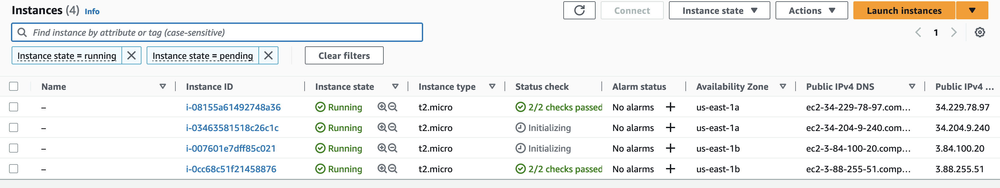

What is done in this task:
- Created AMI image
- Created Load Balancer
- Edited Security Groups so we can access our web app only through LB
- Created Launch Template with AMI image mentioned before
- Created Auto Scaling group with specifications:
  - 2 desired instances
  - 2 min, 4 max instances
  - Dynamic auto scaling if average CPU Utilization > 18%

**Link to the app: http://alb-web-server-527642205.us-east-1.elb.amazonaws.com/**

Diagram:

No of instances after creating load balancer:

No1 of instances after CPU Stress test:

